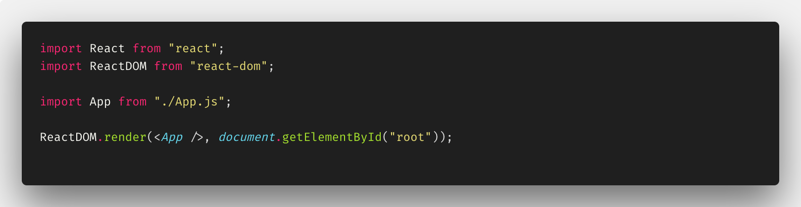
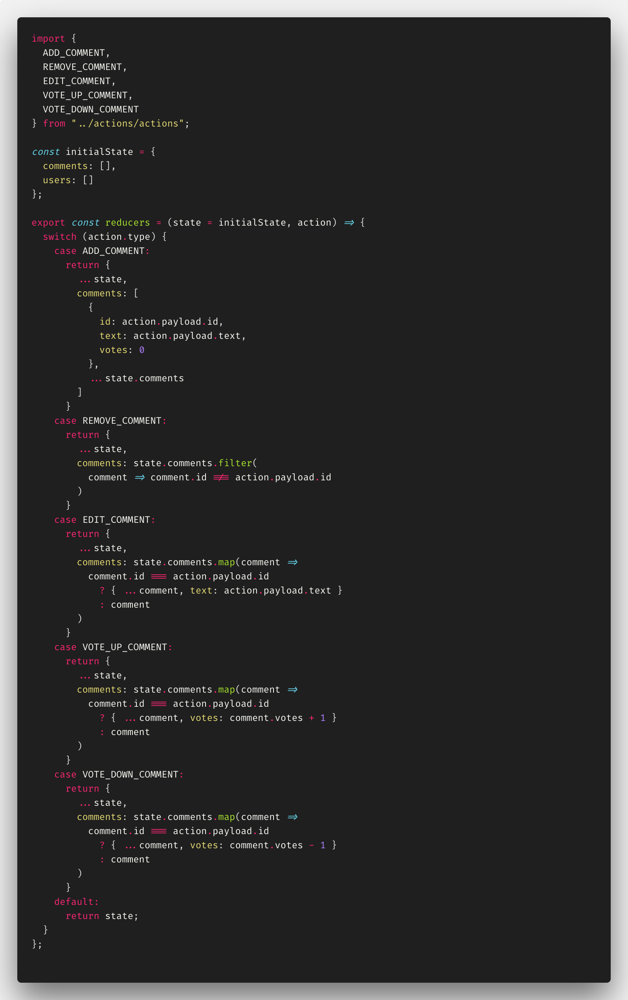

# Redux Workshops

- [Redux Workshops](#redux-workshops)
  - [Three Principles](#three-principles)
  - [Project setup](#project-setup)
  - [App Component - App.js](#app-component---appjs)
  - [Index.js](#indexjs)
  - [Actions](#actions)
    - [Exercise 1](#exercise-1)
  - [Reducers](#reducers)
    - [Exercise 2](#exercise-2)
    - [Combine reducers](#combine-reducers)

## Three Principles

Redux can be described in three fundamental principles:

- **Single source of truth.**
  The state of your whole application is stored in an object tree within a single store.
- **State is read-only.**
  The only way to change the state is to emit an action, an object describing what happened.
- **Changes are made with pure functions**
  To specify how the state tree is transformed by actions, you write pure reducers.

You must always keep in mind these the three principles of Redux.

[Click here for more info](https://redux.js.org/introduction/three-principles)

## Project setup

The playground will be an app for managing comments. There will be a possibility to add, delete, edit and vote for comments.

To create our skylab app, you may choose one of the following methods:

**_npx_**

```bash
npx create-react-app skylab-app
```

**_npm_**

```bash
npm init react-app skylab-app
```

**_Yarn_**

```bash
yarn create react-app skylab-app
```

Now that our project is setup. In your terminal do the following:

```bash
cd skylabs-app
npm start
```

This should start our project on port **3000**


So now we have our boilerplate app. Next, we need to clear the app structure, for that, you need to do the following

```bash
rm src/App.* src/serviceWorker.js src/logo.svg
echo '' > src/index.js
echo '' > src/index.css
```

Before we start coding our app we need to install Redux. To do this type in terminal the following:

For **npm**

```bash
npm install redux react-redux
```

or if you use **Yarn**

```bash
yarn add redux react-redux
```

Right now we can start hacking 😉 our Redux app.

## App Component - App.js

In folder `src` create a file `App.js` which will be containing the following code:


## Index.js

Now let's create `index.js` file. It should be in folder `src`, too.



Now app looks like that:


## Actions

An **action** in Redux is a JavaScript object. It has a **type** and an optional **payload**. The type is often referred to as action type. While the type is a string literal, the payload can be anything from a string to an object.

In our case is an app for managing comments so we need actions, eg. add a comment. This action can look like this:

```javascript
{
    type: "ADD_COMMENT",
    payload: {
        text: "My first comment!"
    }
}
```

Since strings are prone to typos and duplicates it’s better to have action types declared as _constants_. This above action can look this:

```javascript
const ADD_COMMENT = 'ADD_COMMENT';

{
    type: ADD_COMMENT,
    payload: {
        text: "My first comment!"
    }
}
```

It is a best practice to wrap every action within a function. Such function is an **action creator**.

For above action the action creator can look this:

```javascript
const addComment = text => ({
  type: ADD_COMMENT,
  payload: {
    text
  }
});
```

For managing comments we need several types of actions: remove, edit a comment and for voting: thumb up and thumb down.

To remove comment we need know which comment should be removed. This can be done by passing comment's id to an action. The action object `REMOVE_COMMENT` will look like this:

```javascript
{
    type: "REMOVE_COMMENT",
    payload: {
        id: 4 // id of an example comment
    }
}
```

Next edit comment. For successfully edit comment we need exactly know which comment and what is new content of the comment. So an action object should look like this:

```javascript
{
    type: "EDIT_COMMENT",
    payload: {
        id: 4,
        text: "edited comment text!"
    }
}
```

With this knowledge, we can now make actions and action creators for the whole of our app. Let's do this!

Firstly in `src` create folder `actions` and in it create file `actions.js`.
Then create constants for each action name (add, edit, remove, thumb up, thumb down).
Here are the first three:

```javascript
const ADD_COMMENT = "ADD_COMMENT";
const REMOVE_COMMENT = "REMOVE_COMMENT";
const EDIT_COMMENT = "EDIT_COMMENT";
```

Next step is making actions creator. As you know, action creator is a function that returns action object. Let's write it.

```javascript
let commentID = 0;

const addComment = text => ({
  type: ADD_COMMENT,
  payload: {
    id: commentID++,
    text
  }
});
```

\*Note: _the variable `commentID` will store for us the next comment's id value_.

### Exercise 1

Based on the above write missing action types (vote up and vote down) and missing action creators.
Don't forget to export each action and each action creator.

**Don't look below.**

&nbsp;

&nbsp;

&nbsp;

**Try your self!**

&nbsp;

&nbsp;

&nbsp;

**Good job!** Right now your file should look similar to this.


## Reducers

A **reducer** is a **pure function**.
It always produces the same output when the input stays the same. It has no _side-effects_, thus it is only an input/output operation.
A reducer has two inputs: _current application's state and action_.
The state is always the global state object from the Redux store.
The action is the dispatched action with a type and optional payload.
The reducer reduces - that explains the naming - the previous state and incoming action to a new state.

Before we start writing our reducers function we need to think about how the state's structure of our app should look.
Keep in mind that this structure should be as flat as possible.
Our app is a simple case, comments are anonymous so we have only a comment's list - the state structure is an array with comments.

```javascript
{
  comments: [
    {
      id: 1,
      text: "This is the first comment!",
      votes: 10
    },
    {
      id: 2,
      text: "Another comment.",
      votes: -1
    }
  ],
}
```

But...
If comments will be related to a user, the state structure can look like this:

```javascript
{
  comments: [
    {
      id: 1,
      userId: "123aba345",
      text: "This is the first comment!",
      votes: 10
    },
    {
      id: 2,
      userId: "987cad654",
      text: "Another comment.",
      votes: -1
    }
  ],
  users: [
    {
      id: "123aba345",
      firstName: 'John',
      lastName: 'Smith',
    },
    ...
  ]
}
```

Time to write the first reducer.

In `src` create folder `reducers`. In this folder create file `reducers.js`.

As you know, reducer on the input gets a current state.
But...
What if our app just start and there is no current state yet?
For this case, we prepare `initialState` variable.

```javascript
const initialState = {
  comments: [],
  user: []
};
```

Thanks to ES6 syntax - default argument - in the reducer function we can handle the initial application state in a simple way.

```javascript
const reducer = (state = initialState, action) => {
  return state;
};
```

So we have done handling the initial application state. It's time to handle actions.

The reducer calculates the new state depending on the action type.
Moreover, it should return at least the current state when no action type matches.
When the action type matches a valid clause the reducer calculates the new state and returns a new object.

In JavaScript, a **switch case** can help to evaluate different action types.
Otherwise, it returns the previous state as default.

Let's start with the add comment action.

```javascript
const reducer = (state = initialState, action) => {
  switch (action.type) {
    case ADD_COMMENT:
      return {
        ...state,
        comments: [
          {
            id: action.payload.id,
            text: action.payload.text,
            votes: 0
          },
          ...state.comments
        ]
      };
    default:
      return state;
  }
};
```

But...
The reducer doesn't know what is `ADD_COMMENT`, because all our actions types are defined in file `actions.js`. There are exported, too. Time to import this action on the top of the reducer file.

```javascript
import { ADD_COMMENT } from "../actions/actions";
```

So the first change of app state is handled.

The case that needs more effort on the first sight is the remove comment action.
The new state should contain a comments list (array) without the one removed comment.
But...

With `Array.filter()` method - it will be easy. All that we need to do is filter the current comments list and return all comments with _id_ different than removed one.

```javascript
const reducer = (state = initialState, action) => {
  switch (action.type) {
    case ADD_COMMENT:
      ...
    case REMOVE_COMMENT:
      return {
        ...state,
        comments: state.comments.filter(comment => comment.id !== action.payload.id)
      }
    default:
      return state;
  }
};
```

### Exercise 2

The goal is to write code for handling all other actions (edit, vote). Note that voting is two different actions (`VOTE_UP_COMMENT` and `VOTE_DOWN_COMMENT`). Remember to import all of the actions.

**Don't look below.**

&nbsp;

&nbsp;

&nbsp;

**Try your self!**

&nbsp;

&nbsp;

&nbsp;

**Good job!** Right now your file should looks similar to this.



### Combine reducers
